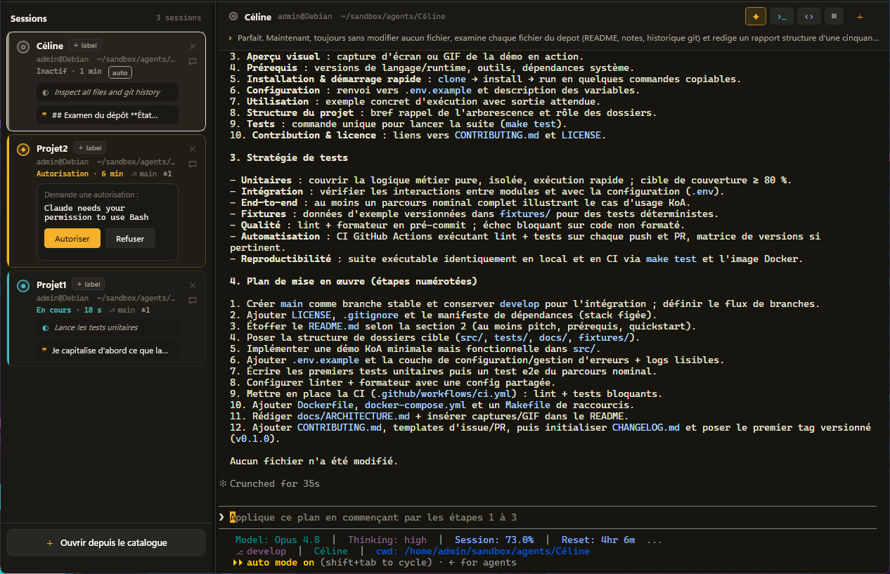
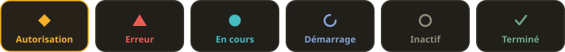
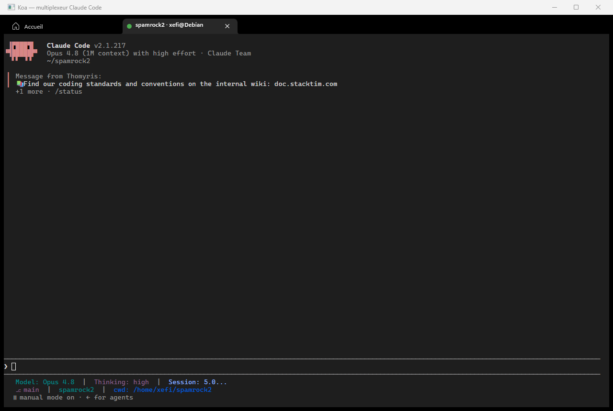

<div align="center">


# KoA — Kingdom of Agents

**Le royaume, c'est votre poste de travail. Les agents, ce sont vos sessions Claude Code.<br/>KoA, c'est la salle du trône d'où vous les voyez tous.**

[](../../releases/latest)
[](../../releases)


**[⬇ &nbsp;Télécharger la dernière version](../../releases/latest)**



</div>

## Pourquoi KoA

Plusieurs sessions **Claude Code** tournent en parallèle, dans plusieurs projets, sous
plusieurs utilisateurs WSL. Sans outil : des terminaux ouverts à la main, des `su`, des `cd`,
des `claude` enchaînés — et plus aucune vue d'ensemble. Impossible de savoir d'un coup d'œil
laquelle attend une autorisation, laquelle a fini, laquelle tourne encore.

KoA est une application **Windows native** (WinUI 3) qui réunit tout ça dans une fenêtre :

| | |
|---|---|
| **Supervision** | l'état de toutes les sessions en un coup d'œil, même fenêtre réduite |
| **Sollicitation** | parler à une session précise sans aller la chercher |
| **Orchestration** | coordonner le travail entre agents, éviter les conflits |

## Le langage d'état

Toute l'identité de KoA tient dans six états, lisibles par **couleur + forme + libellé** —
jamais par la couleur seule :

<div align="center">

</div>

L'or est **réservé** à la session qui vous attend : seule à pulser, toujours remontée en tête
de la barre latérale. Une session bloquée sur une permission ne peut pas se noyer dans le flux.

## Ce que KoA sait faire

- **Toutes vos sessions dans une barre latérale** — pastille d'état, activité en clair, durée,
  branche et statut git. Quatre largeurs, du rail de 64 px qui garde la supervision en vision
  périphérique à la vue large où toutes les actions sont visibles.
- **Autoriser ou refuser sans ouvrir la session** — la demande de l'agent s'affiche sur la
  vignette, deux boutons suffisent. Et quand la fenêtre est réduite, le **dock** garde la
  session la plus urgente à portée de clic :

  

- **Répondre à un agent depuis sa vignette** — sans quitter ce que vous étiez en train de faire.
- **Un vrai terminal** — chaque session vit dans un terminal complet, au thème assorti à
  l'application, pas dans un aperçu.
- **Un catalogue de raccourcis** — distro, utilisateur, répertoire, commande de pré-lancement ;
  groupes réordonnables, recherche, lancement rapide sans rien enregistrer.
- **Quatre façons d'ouvrir un contexte** — avec Claude, en shell nu, dans VS Code, ou dans
  l'Explorateur Windows.
- **Reprendre une conversation** — relire le transcript d'une session passée et repartir où
  l'agent s'était arrêté.
- **Multi-utilisateurs, multi-distros** — chaque session tourne sous l'utilisateur et la
  distribution WSL de son projet, sans se marcher dessus.

<div align="center">

</div>

## Sous le capot

KoA injecte un identifiant dans l'environnement de l'agent au lancement ; un hook déployé
automatiquement le renvoie avec le `session_id` de Claude Code. La corrélation est explicite
dès la première seconde — aucune heuristique. Les hooks sont la seule source de vérité du
statut temps réel ; le transcript ne sert qu'à la relecture.

## Installer

👉 **[Télécharger la dernière version](../../releases/latest)** — deux fichiers y sont joints :

| Fichier | Pour qui |
|---|---|
| `KoA-<version>-win-x64.msi` | **le plus simple** — double-clic, aucun droit d'administrateur, raccourci au menu Démarrer, désinstallation propre |
| `KoA-<version>-win-x64.zip` | qui préfère ne rien installer, ou dont l'entreprise bloque les `.msi` |

**Windows affichera « Windows a protégé votre ordinateur »** : le paquet n'est pas signé — ce
n'est pas une menace détectée, c'est l'absence de signature.

Plutôt que de cliquer *Exécuter quand même* sans rien vérifier, deux gestes dans PowerShell, une
fois pour toutes : `Get-FileHash` pour comparer l'empreinte à celle publiée dans la release, puis
`Unblock-File` pour retirer le marquage « téléchargé depuis Internet ». L'avertissement ne revient
plus pour ce fichier. Les deux commandes exactes et l'empreinte de la version sont **en bas de la
page de la release**.

<details>
<summary><strong>Si vous prenez le <code>.zip</code> — à lire avant de lancer</strong></summary>

**Extrayez-le avant de lancer KoA** — clic droit sur l'archive → *Extraire tout*.

Double-cliquer `Koa.App.exe` depuis l'aperçu du zip fait apparaître un message réclamant
l'installation du **.NET Desktop Runtime**. Ce message est trompeur : le runtime est bien dans
l'archive, mais Windows n'aura extrait qu'un fichier sur 599. **Ne l'installez pas**, cela ne
débloquerait rien.

</details>

### Prérequis

Deux choses qu'aucun paquet ne peut embarquer :

- **WSL2**, avec au moins une distribution et **Claude Code** installé dedans ;
- le **runtime WebView2** — déjà présent sur un Windows à jour.

Windows 10 version 2004 ou plus récent, 64 bits.

### Au premier lancement

KoA dépose son hook dans `~/.koa/` et fusionne les entrées nécessaires dans le
`~/.claude/settings.json` de la distribution, après sauvegarde en `settings.json.koa-backup`.
Sans ce hook, les sessions s'ouvrent mais leur état n'est pas suivi.

Vos données — catalogue, sessions, journaux — vivent dans `%LOCALAPPDATA%\Koa`. **La
désinstallation ne les touche pas.**

## Remonter un défaut

Indiquez la version affichée en haut à gauche de la fenêtre, et joignez le journal du jour :

```
%LOCALAPPDATA%\Koa\logs\koa-AAAAMMJJ.log
```

Pour un journal détaillé, lancez KoA avec `KOA_LOG_LEVEL=Verbose`.

---

<div align="center">


Ce dépôt ne contient **que les binaires** et leurs notes de version. Les sources sont privées.

</div>
